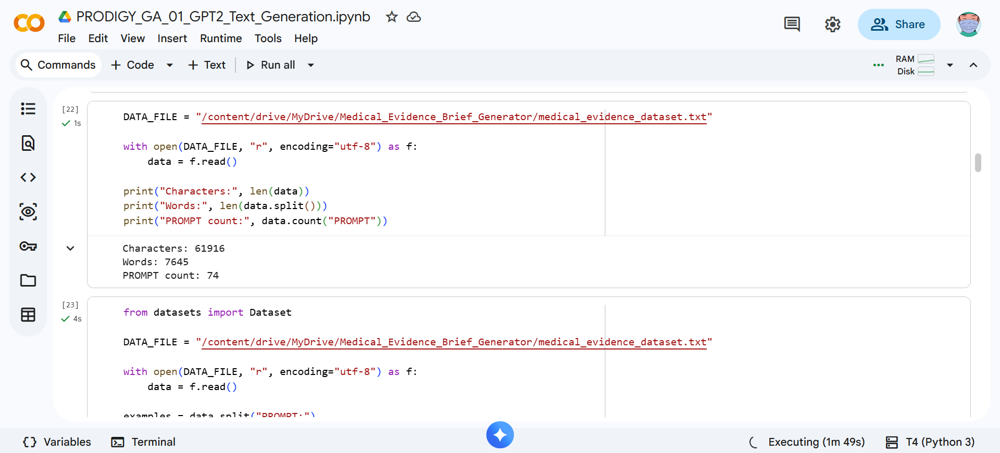
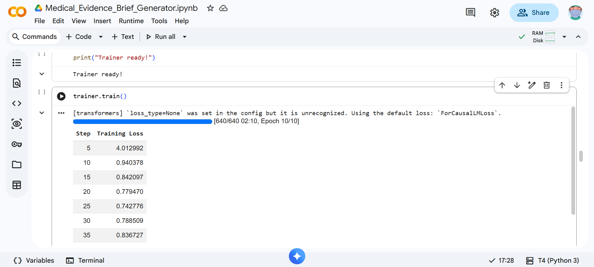
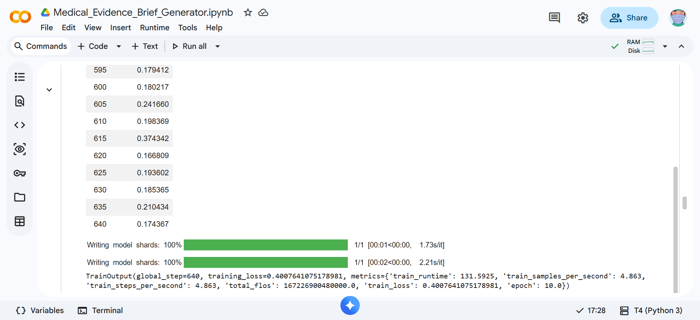
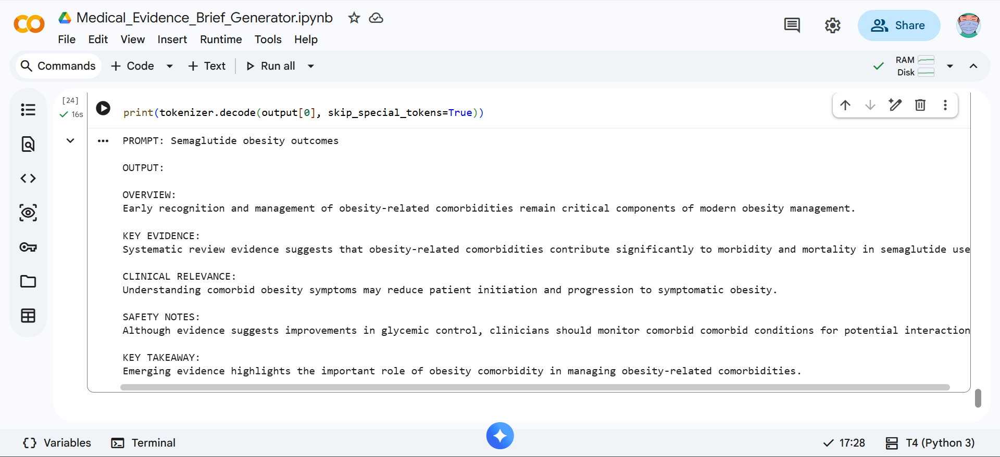

# PRODIGY_GA_01
## Medical Evidence Brief Generator using GPT-2

## Overview
This project fine-tunes GPT-2 on a custom healthcare dataset to generate structured clinical evidence briefs from short medical prompts. The model was trained on curated examples covering diabetes, cardiovascular disease, heart failure, GLP-1 receptor agonists, SGLT2 inhibitors, and related therapeutic areas.

The generated output follows a standardized format containing:

- Overview
- Key Evidence
- Clinical Relevance
- Safety Notes
- Key Takeaway

This enables rapid generation of concise evidence summaries for healthcare professionals, medical writers, and health-tech applications.

## Project Objective
Develop a domain-specific text generation model capable of producing coherent and contextually relevant clinical evidence briefs from a single short prompt.

## Dataset
Custom healthcare training dataset containing:

74 structured prompt-output examples
61,916 characters
7,645 words

## Topics included: 
Semaglutide
Empagliflozin
SGLT2 Inhibitors
Heart Failure
Tirzepatide
Cardiovascular Diseases
Type 2 Diabetes
GLP-1 Receptor Agonists

## Technologies Used
- Python
- Hugging Face Transformers
- PyTorch
- Datasets Library
- Google Colab

## Training Details
- Base Model: GPT-2
- Fine-tuning Framework: Hugging Face Transformers
- Training Steps: 640
- Final Training Loss: ~0.40
  
## Sample Prompt
PROMPT: Semaglutide obesity outcomes

## Sample Generated Output
OVERVIEW:
Early recognition and management of obesity-related comorbidities remain critical components of modern obesity management.

KEY EVIDENCE:
Systematic review evidence suggests that obesity-related comorbidities contribute significantly to morbidity and mortality in semaglutide users.

CLINICAL RELEVANCE:
Understanding comorbid obesity symptoms may reduce patient initiation and progression to symptomatic obesity.

SAFETY NOTES:
Although evidence suggests improvements in glycemic control, clinicians should monitor comorbid comorbid conditions for potential interactions.

KEY TAKEAWAY:
Emerging evidence highlights the important role of obesity comorbidity in managing obesity-related comorbidities.

## Repository Structure
PRODIGY_GA_01
│
├── medical_evidence_dataset.txt
├── PRODIGY_GA_01_GPT2_Text_Generation.ipynb
├── requirements.txt
├── README.md
└── screenshots/

## Screenshots

### Dataset Statistics

### Training Progress

### Training Completion

### Generated Output

Internship Information

Completed as part of the Generative AI Internship Program at Prodigy InfoTech.
